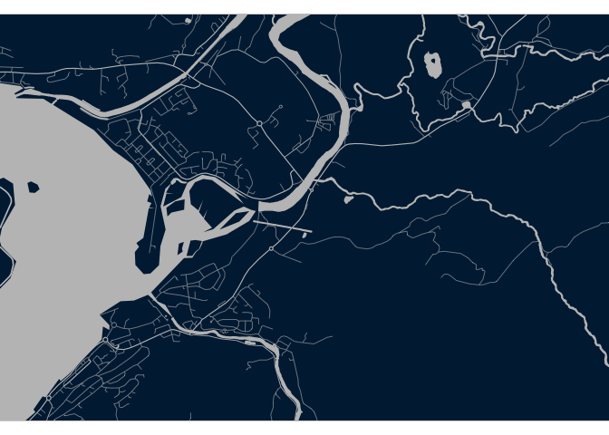
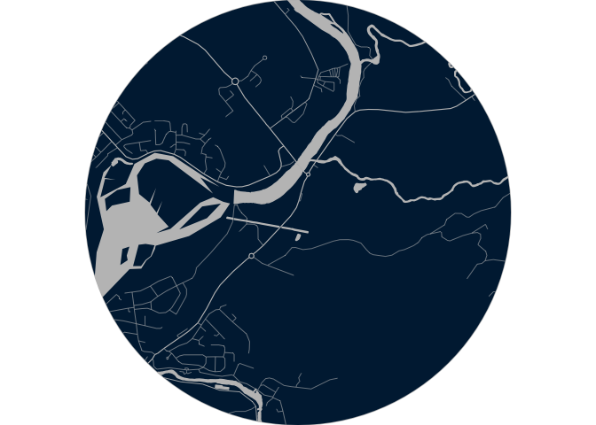

<!-- README.md is generated from README.Rmd. Please edit that file -->

# aesmapr

<!-- badges: start -->
<!-- badges: end -->

`aesmapr` helps you create nice looking (decorative) maps of a local
area.

Due to data availability, it can currently be used for GB locations
only.

## Installation

You can install the development version of aesmapr from
[GitHub](https://github.com/) with:

``` r
# install.packages("devtools")
devtools::install_github("n-fanton/aesmapr")
```

## Example

The main function in `aesmapr` is `create_map()`, which allows you to
vary the location, shape, and extent of your outputs.

``` r
library("aesmapr")

map_1 <- create_map(
  postcode = "PH33 6TQ",
  x_dist = 3000,
  y_dist = 2000
)
#> ── Attaching packages ─────────────────────────────────────── tidyverse 1.3.1 ──
#> ✓ ggplot2 3.3.5     ✓ purrr   0.3.4
#> ✓ tibble  3.1.6     ✓ dplyr   1.0.7
#> ✓ tidyr   1.1.4     ✓ stringr 1.4.0
#> ✓ readr   2.1.1     ✓ forcats 0.5.1
#> ── Conflicts ────────────────────────────────────────── tidyverse_conflicts() ──
#> x dplyr::filter() masks stats::filter()
#> x dplyr::lag()    masks stats::lag()
#> Linking to GEOS 3.8.1, GDAL 3.2.1, PROJ 7.2.1
#> Warning: The `x` argument of `as_tibble.matrix()` must have unique column names if `.name_repair` is omitted as of tibble 2.0.0.
#> Using compatibility `.name_repair`.
#> This warning is displayed once every 8 hours.
#> Call `lifecycle::last_lifecycle_warnings()` to see where this warning was generated.
#> Reading layer `NN_Road' from data source 
#>   `/Users/Shared/data/shapefiles/local_map/NN_Road.shp' using driver `ESRI Shapefile'
#> Simple feature collection with 16557 features and 7 fields
#> Geometry type: LINESTRING
#> Dimension:     XYZ
#> Bounding box:  xmin: 192147.8 ymin: 696679.9 xmax: 306104 ymax: 805219
#> z_range:       zmin: 0 zmax: 0
#> Projected CRS: OSGB 1936 / British National Grid
#> Warning: attribute variables are assumed to be spatially constant throughout all
#> geometries
#> Reading layer `NN_SurfaceWater_Area' from data source 
#>   `/Users/Shared/data/shapefiles/local_map/NN_SurfaceWater_Area.shp' 
#>   using driver `ESRI Shapefile'
#> Simple feature collection with 7256 features and 2 fields
#> Geometry type: POLYGON
#> Dimension:     XYZ
#> Bounding box:  xmin: 186885.1 ymin: 681937.6 xmax: 306649.8 ymax: 810745
#> z_range:       zmin: 0 zmax: 0
#> Projected CRS: OSGB 1936 / British National Grid
#> Warning: attribute variables are assumed to be spatially constant throughout all
#> geometries

map_1
```



Maps can also draw circular areas, rather than rectangles:

``` r
map_2 <- create_map(
  postcode = "PH33 6TQ",
  shape = "circle",
  radius = 1500
)
#> New names:
#> * `` -> ...1
#> * `` -> ...2
#> Reading layer `NN_Road' from data source 
#>   `/Users/Shared/data/shapefiles/local_map/NN_Road.shp' using driver `ESRI Shapefile'
#> Simple feature collection with 16557 features and 7 fields
#> Geometry type: LINESTRING
#> Dimension:     XYZ
#> Bounding box:  xmin: 192147.8 ymin: 696679.9 xmax: 306104 ymax: 805219
#> z_range:       zmin: 0 zmax: 0
#> Projected CRS: OSGB 1936 / British National Grid
#> Warning: attribute variables are assumed to be spatially constant throughout all
#> geometries
#> Reading layer `NN_SurfaceWater_Area' from data source 
#>   `/Users/Shared/data/shapefiles/local_map/NN_SurfaceWater_Area.shp' 
#>   using driver `ESRI Shapefile'
#> Simple feature collection with 7256 features and 2 fields
#> Geometry type: POLYGON
#> Dimension:     XYZ
#> Bounding box:  xmin: 186885.1 ymin: 681937.6 xmax: 306649.8 ymax: 810745
#> z_range:       zmin: 0 zmax: 0
#> Projected CRS: OSGB 1936 / British National Grid
#> Warning: attribute variables are assumed to be spatially constant throughout all
#> geometries

map_2
```



I’ll continue to add functionality to this package as I work more on it!
